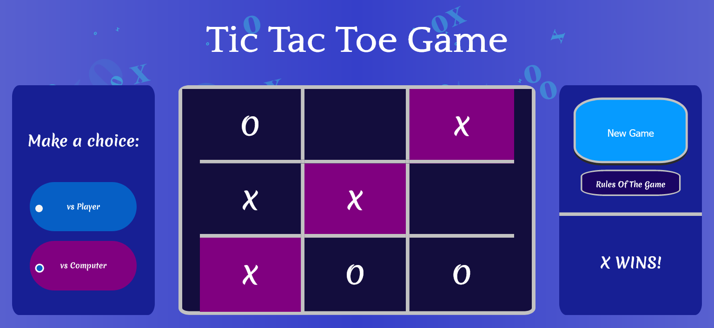

# TicTacToeGame

* Tic-tac-toe game is a game for two players (or a player and the computer), who take turns in entering Xs and Os marking the spaces in a 3×3 grid. The player who succeeds in placing three of their marks in a diagonal, horizontal, or vertical row is the winner.

* _Technologies that were used on this project are: HTML, CSS and Vanilla JavaScript._

* _It's design is responsive which means that it's content gets rearranged for smaller screens._

* This is a photo of a Tic-tac-toe game.

 
   